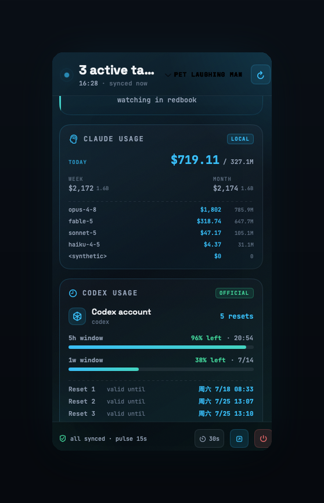
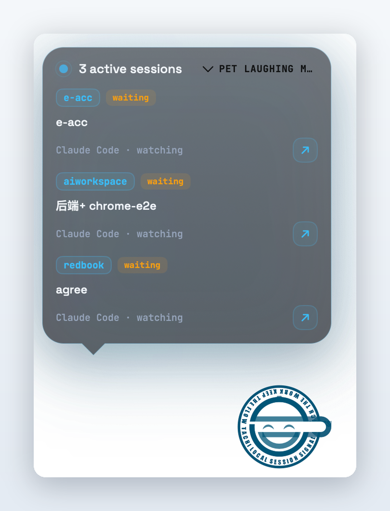

# Tachi

<p align="center">
  
</p>

<p align="center">
  <strong>See your AI coding sessions and token spend, right in the menu bar.</strong>
</p>

<p align="center">
  <a href="https://github.com/seasonsolt/e-acc/releases/latest">Download</a>
  ·
  <a href="#what-you-see">Features</a>
  ·
  <a href="#private-by-design">Privacy</a>
  ·
  <a href="#install">Install</a>
</p>

Tachi is a small macOS menu bar app that shows your live AI-coding sessions and token spend — Claude Code, Codex, OpenCode, and more. It reads the local files those tools already write, so there is no account to create, no API key to paste, and nothing leaves your Mac.

It is for people who live inside coding agents and want a quick pulse on what is running, without opening yet another dashboard.

<p align="center">
  
</p>

## Supported tools

Tachi picks up active sessions from the tools you already run, no setup:

| Tool | Read from |
| --- | --- |
| Claude Code | `~/.claude` session transcripts |
| Codex | `~/.codex` sessions + quota |
| OpenCode | local session database |
| Claude Design | the Claude desktop app |
| Pencil | running app |

## What You See

- **Live sessions in the menu bar.** A compact readout in the menu bar, and a click-away panel listing what is running, waiting, or idle across every supported tool.
- **Real Claude Code usage.** Today / this week / this month cost and tokens, broken down per model (Opus, Sonnet, Haiku, …). It is computed locally from your own transcripts — the same approach as [`ccusage`](https://github.com/ryoppippi/ccusage) — so the numbers are yours, not an estimate, and no key is involved.
- **Codex quota at a glance.** Your 5-hour and weekly windows with percent left and reset times.
- **A desktop companion.** A small pet floats on your second monitor and reacts to how hard you are working — the more sessions running in parallel, the livelier it gets. Hover it to peek at the active task list; drag it anywhere. Four themes, each with its own companion.

<p align="center">
  
</p>

## Private by Design

<p align="center">
  
</p>

Tachi is local-first, on purpose:

- It reads only the standard session files the tools already keep on disk. Nothing is uploaded, and there is no telemetry.
- No account and no API key are needed for session tracking or usage — it is all derived from local data.
- The local link the app uses is bound to loopback, so it is not reachable from your network.
- Open source, free, and a native Swift app. Requires macOS 14 (Sonoma) or later.

## Install

Grab the latest DMG:

**[⬇ Download the latest release](https://github.com/seasonsolt/e-acc/releases/latest)**

1. Open `Tachi-<version>.dmg` and drag **Tachi.app** onto **Applications**.
2. Clear the download quarantine once (below), then launch Tachi — it lives in the menu bar.

### First launch: "Apple cannot verify Tachi"

Tachi is ad-hoc signed (there is no paid Apple Developer ID yet), so macOS blocks it the first time with *"Apple cannot verify 'Tachi' is free of malware."* On macOS 15 (Sequoia) that dialog no longer has an **Open** button, so use one of these one-time fixes:

```bash
xattr -dr com.apple.quarantine /Applications/Tachi.app
```

Then double-click Tachi — it opens normally from then on. (Or: try to open it once, then **System Settings → Privacy & Security → Open Anyway**.)

This is expected for any unsigned app. A fully frictionless install needs Developer ID signing and notarization, which is on the roadmap.

## Status

Early release, in active use. Session tracking and the Claude/Codex usage cards work today; the current build is unsigned. Next up is a signed, notarized release for a one-click install.

## For Builders

This is a monorepo. The macOS app is in [`eacc-panel`](eacc-panel) (Swift); a companion web screen and CLI live in [`eacc-screen`](eacc-screen). Start with `eacc-panel` to understand the product; see the in-repo docs for implementation details.
