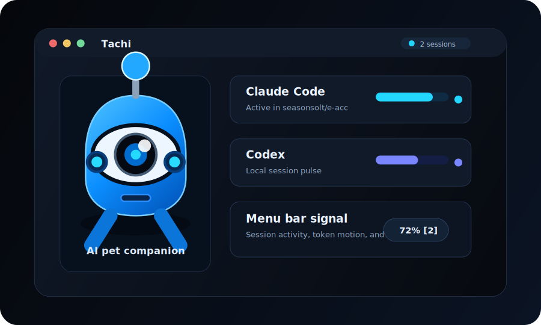
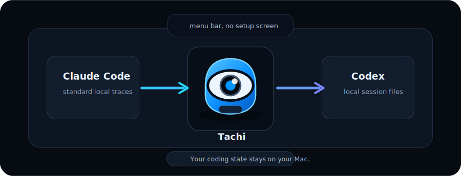

# Tachi

<p align="center">
  
</p>

<p align="center">
  <strong>Your reliable electronic pet for AI coding.</strong>
</p>

<p align="center">
  <a href="https://github.com/seasonsolt/e-acc/releases/latest">Download</a>
  |
  <a href="#what-you-get">What you get</a>
  |
  <a href="#status">Status</a>
</p>

Tachi watches your local Claude Code and Codex work, keeps a pulse on active sessions, and turns background tool state into a focused ambient presence. You get a small signal in the menu bar, a richer panel when you need context, and a companion that feels alive during long coding runs.

It is for people who live inside coding agents and want awareness without another dashboard.

<p align="center">
  
</p>

## Why Tachi

The name is short, friendly, and easy to remember. It sounds like a little machine companion that stays close to your desk, notices the state of your work, and waits without getting in the way.

That is the product we want: an electronic pet for the AI era. Tachi does not write code for you. It keeps watch while your coding agents work, shows when sessions are active, and gives the background motion of Claude Code and Codex a face you can recognize.

## Why It Exists

AI coding tools create a lot of invisible motion. Sessions start, drift, pause, finish, and disappear into logs. Tachi gives that motion a home.

It does not ask you to manage another workspace. It sits in the menu bar, reads the standard local traces from the tools you already use, and shows the state of your work with a low-friction interface.

<p align="center">
  
</p>

## What You Get

| Experience | What it feels like |
| --- | --- |
| Live session awareness | Claude Code and Codex activity appears without setup screens or manual import. |
| Menu bar signal | A compact status readout changes as work becomes active. |
| Companion panel | Open the panel when you want session context, token motion, and theme state. |
| Cinematic themes | The eclipse theme gives long coding runs a visual mood instead of a utility-table look. |
| Local-first monitoring | Tachi reads standard traces from your Mac. Your coding state stays close to the tools that created it. |

## Built Around Mood

Tachi borrows from terminal glow, machine-room glass, and late-night coding rooms. The mark is a compact blue companion with a single lens, polished shell, and soft mechanical detail. It should feel like a small agent sitting at the edge of your workspace.

The first theme still centers on a real eclipse motion: the light disappears as the moon covers the sun, and the stone form becomes the anchor of the scene.

## Download & Install

Grab the latest DMG from GitHub:

[Download the latest release](https://github.com/seasonsolt/e-acc/releases/latest)

1. Open `Tachi-<version>.dmg` and drag **Tachi.app** onto the **Applications** folder.
2. Clear the download quarantine once (see below), then launch Tachi from Applications — it lives in the menu bar.

### First launch: "Apple cannot verify Tachi"

Tachi is an open-source, **ad-hoc-signed** build — there is no paid Apple Developer ID yet — so macOS Gatekeeper blocks it on first launch with *"Apple cannot verify 'Tachi' is free of malware."* On macOS 15 (Sequoia) that dialog no longer offers an **Open** button, so use one of these one-time fixes:

**Terminal (recommended, one command):**

```bash
xattr -dr com.apple.quarantine /Applications/Tachi.app
```

Then double-click Tachi in Applications — it opens normally from then on.

**Or via System Settings:** try to open Tachi once, then go to **System Settings → Privacy & Security**, scroll to the message about Tachi, and click **Open Anyway**.

This is expected for any unsigned app; it is not specific to Tachi. A fully frictionless install needs Developer ID signing + Apple notarization, which is on the roadmap.

## Status

Tachi is in early release.

The app already tracks standard local Claude Code and Codex sessions and ships with setup screens removed. The next milestone is a signed macOS release with the Tachi name, icon, and cleaner install path.

## For Builders

This repository also contains the screen experience and supporting CLI pieces. The product-facing macOS app lives in `eacc-panel`, now branded as Tachi.

Use the repository docs when you need implementation details. Start with Tachi when you want to understand the product.
